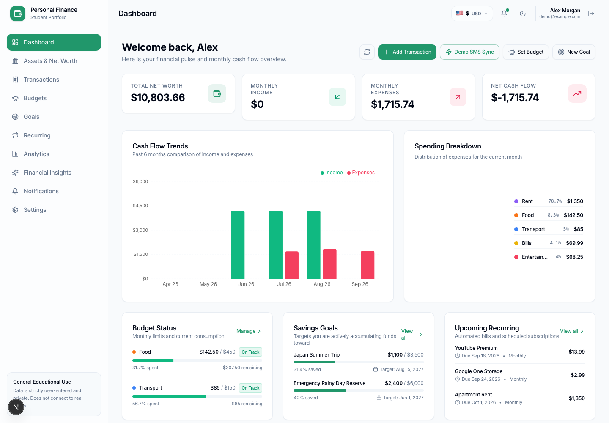

# Personal Finance Manager

A portfolio-grade personal finance application for transaction tracking, budgets, savings goals, assets, recurring cash flow, and educational analytics. It is built with Next.js 15, TypeScript, PostgreSQL, Prisma, Auth.js, Tailwind CSS, and Recharts.

> Financial insights are educational organizational aids—not financial, investment, tax, or legal advice. “Demo SMS Sync” is a simulator and does not connect to a bank, card network, or wallet provider.

## Highlights

- Fixed-precision PostgreSQL money storage and Decimal-based server calculations
- Authenticated, user-isolated accounts, categories, transactions, budgets, goals, assets, and insights
- Idempotent recurring processing and simulated SMS charge approval
- TOTP two-factor authentication with encrypted secrets and hashed one-time recovery codes
- CSV preview/import with validation and duplicate detection; CSV and versioned JSON exports
- Timezone-aware reporting periods and configurable display currency
- Deterministic demo workspace reset for portfolio walkthroughs
- Unit, PostgreSQL integration, Playwright E2E, and CI verification



## Quick Start

Requirements: Node.js 20+, npm 9+, and Docker.

```bash
npm install
cp .env.example .env
docker compose up -d
npx prisma migrate deploy
npx prisma db seed
npm run dev
```

Open [http://localhost:3004](http://localhost:3004). The seeded demo account is `demo@example.com` / `password123`.

The web app is installable through its manifest. It does not claim offline functionality and does not ship a service worker.

## Verification

```bash
npm run lint
npx tsc --noEmit
npm test
npm run test:integration
npm run test:e2e
npm run build
```

Database integration tests require `RUN_DATABASE_TESTS=true` and a migrated test database. Playwright installs its browser with `npx playwright install chromium`.

## Existing Database Migration

The repository now includes a migration baseline. For an existing database originally created with `prisma db push`, mark only the baseline as already applied, then deploy the financial-integrity migration:

```bash
npx prisma migrate resolve --applied 20260901000000_initial
npx prisma migrate deploy
```

The second migration casts existing floating-point monetary values to fixed precision without dropping records. Back up the database before any production migration.

## Documentation

- [Architecture](docs/architecture.md)
- [API](docs/api.md)
- [Database and migrations](docs/database.md)
- [Security and privacy](docs/security.md)
- [Development](docs/development.md)

MIT licensed.
