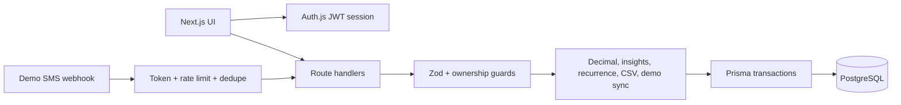

# Architecture

Personal Finance Manager is a modular monolith built on the Next.js App Router. Client feature pages call same-origin route handlers; route handlers authenticate the user, validate input with Zod, enforce ownership, and use Prisma to access PostgreSQL.

## Major Flows

- Ledger: accounts and assets establish tracked value; transactions provide income and expense cash flow.
- Planning: budgets, savings goals, and recurring templates derive progress and projections from the ledger.
- Reporting: dashboard, analytics, and insights query bounded UTC ranges calculated from the user’s IANA timezone.
- Demo SMS Sync: fictional provider alerts create pending records; the user reviews them before an atomic ledger write.
- Privacy: a versioned export covers every user-owned financial model; wipe removes financial and sync state but preserves login and security configuration.

Money is stored as `Decimal`, converted to JSON numbers at the API boundary for compatibility, and formatted using the selected currency in the UI.
